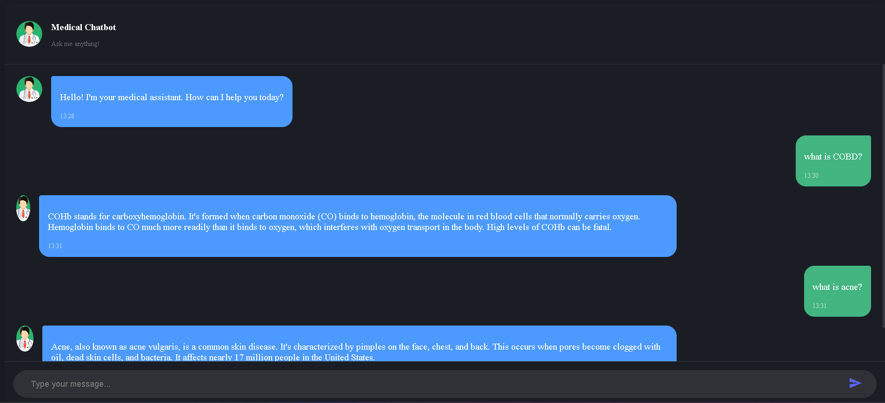

# Medical-Generative-AI-Chatbot
A medical information assistant powered by Generative AI that provides accurate health information based on trusted medical sources documents.

## Overview

This project implements a Retrieval-Augmented Generation (RAG) chatbot that answers medical questions using information from medical databases and encyclopedias. The chatbot uses Google's Gemini 1.5 Pro model enhanced with document retrieval to provide reliable medical information.

## DEMO


## Features
- **Accurate Medical Information**: Retrieves information from trusted medical sources

- **User-friendly Interface**: Simple chat interface with typing indicators
- **Retrieval-Augmented Generation**: Combines the power of LLMs with fact-based document retrieval
- **Vector Database Integration**: Uses Pinecone for efficient similarity search of medical documents
## Tech Stack
- Frontend: HTML, CSS, JavaScript
- Backend: Flask (Python)
- Language Model: Google Gemini 1.5 Pro
- Vector Database: Pinecone
- Embedding Model: HuggingFace embeddings
- RAG Framework: LangChain
## Installation
1. **Clone the repository**:
    ```markdown
    git clone https://github.com/quan23w/Medical-Generative-AI.git
    cd Medical-Generative-AI
    ```
2. **Create and activate a virtual environment**:
    ```markdown
    python -m venv venv
    source venv/bin/activate  # On Windows: venv\Scripts\activate
    
    ```
3. **Install the required dependencies**:
    ```markdown
    pip install -r requirements.txt
    ```
4. **Create a ```.env``` file with your API keys**:
    ```markdown
    PINECONE_API_KEY= your_pinecone_api_key
    GOOGLE_API_KEY= your_google_api_key
    ```   
## Usage
To run the application locally, navigate to the project directory and start the Flask server:
```markdown
python app.py
```
The application will be available at:
```markdown
http://localhost:8080
```

## Project Structure
```
Medical-Generative-AI/
├── app.py                  # Flask application
├── requirements.txt        # Python dependencies
├── static/                 # Static assets
│   ├── css/                # CSS stylesheets
│   ├── js/                 # JavaScript files
│   │   └── script.js       # Chat functionality
│   └── image/              # Images including avatar
├── templates/              # HTML templates
│   └── chat.html           # Main chat interface
└── src/                    # Source code
    ├── helpers.py          # Helper functions
    └── prompt.py           # Prompt templates for the LLM
```


## Future Improvements
- Add conversation history for more contextual responses
- Implement source citations in responses
- Add medical specialization filtering
- Improve response formatting for better readability
- Deploy to a cloud platform for wider accessibility

## License

- MIT License

## Acknowledgements
- Medical content sourced from trusted medical encyclopedias and databases
- Built with LangChain, Pinecone, and Google Gemini AI